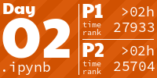
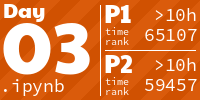

# 🎄 Advent of Code 2022 🎄

My solutions to the 2022 Advent of Code as shiny Jupyter notebooks. The markdown for each day is available in the corresponding notebook. The markdown was extracted with the [aoc-to-markdown](https://github.com/kfarnung/aoc-to-markdown) Chrome extension.

**You can run and interact with the code and the solutions directly from your browser via [Binder](https://mybinder.org/v2/gh/markusschanta/advent-of-code-2022/HEAD).**

## Table of Contents

* [Day 1: Calorie Counting](day.01.ipynb)
* [Day 2: Rock Paper Scissors](day.02.ipynb)
* [Day 3: Rucksack Reorganization](day.03.ipynb)

<!-- AOC TILES BEGIN -->
<h1 align="center">
  2022 - 6 ⭐
</h1>

<!-- AOC TILES END -->
