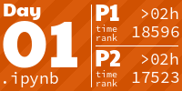
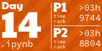

# 🎄 Advent of Code 2022 🎄

My solutions to the 2022 Advent of Code as Jupyter notebooks. The markdown for each day is available in the corresponding notebook. The markdown was extracted with the [aoc-to-markdown](https://github.com/kfarnung/aoc-to-markdown) Chrome extension.

**You can run and interact with the code and the solutions directly from your browser via [Binder](https://mybinder.org/v2/gh/markusschanta/advent-of-code-2022/HEAD).**

## About Advent of Code

[Advent of Code](https://adventofcode.com/) is an annual set of Christmas-themed computer programming challenges that follow an [Advent calendar](https://en.wikipedia.org/wiki/Advent_calendar). It has been running since 2015. The programming puzzles cover a variety of skill sets and skill levels and can be solved using any programming language. Participants also compete based on speed on both global and private [leaderboards](https://adventofcode.com/2022/leaderboard).

<!-- AOC TILES BEGIN -->
<h2>
  Advent of Code 2022 - Stars Collected: 28 ⭐
</h2>

  The follwing table lists all solutions per day along with the corresponding completion time and rank. The table was generated using <a href="https://github.com/LiquidFun/adventofcode/tree/main/AoCTiles">AoCTiles</a>.

<!-- AOC TILES END -->
